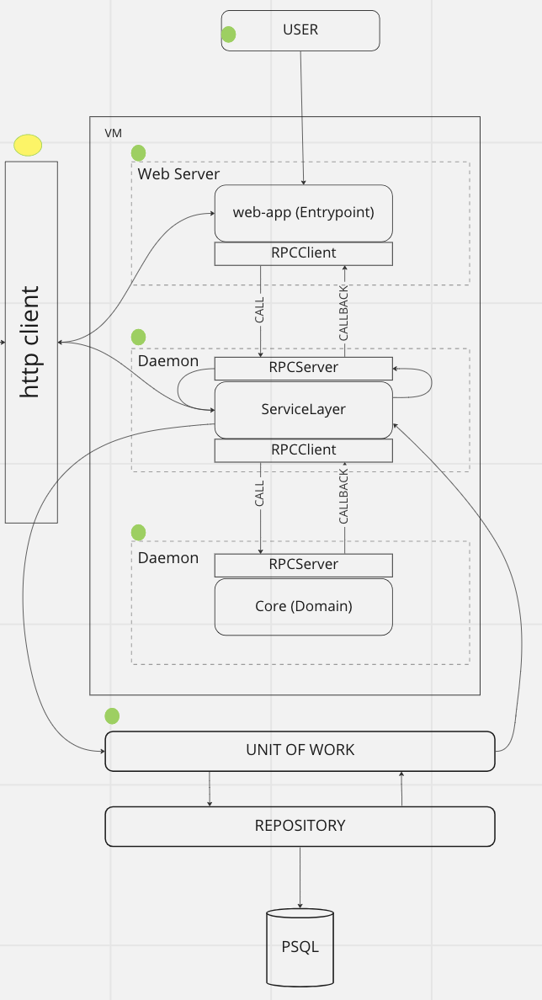

OnBoarding
----------

Before you start working on *inTakevms*, we recommend that you read the material on *Domain Driven Design (DDD)*, which we used during development.

### Books
* "Domain-Driven Design: Tackling Complexity in the Heart of Software" Eric Evans is a classic resource that introduces the general principles of *DDD*.
* "Python Development Patterns: TDD, DDD, and Event-Driven Architecture" by Harry Percival and Bob Gregory is a great resource that presents examples of patterns implemented in python.

### Technologies
* [RabbitMQ](https://www.rabbitmq.com/tutorials/tutorial-one-python.html) - message queues.
* [PostgreSQL](https://www.postgresql.org/docs/current/) - database.
* [FastAPI](https://fastapi.tiangolo.com/) - web application framework.

### Patterns
* [RPC](https://www.rabbitmq.com/tutorials/tutorial-six-python.html) - a way of communicating between different levels of a module.
* [AbstractFactory](https://habr.com/ru/post/465835/) - used for unified domain selection.
* [Repository](https://learn.microsoft.com/en-en/aspnet/mvc/overview/older-versions/getting-started-with-ef-5-using-mvc-4/implementing-the-repository-and-unit-of-work-patterns-in-an-asp-net-mvc-application)
* [UnitOfWork](https://learn.microsoft.com/en-en/aspnet/mvc/overview/older-versions/getting-started-with-ef-5-using-mvc-4/implementing-the-repository-and-unit-of-work-patterns-in-an-asp-net-mvc-application)

### Libraries
* [Toml](https://toml.io/en/)
* [Alembic](https://alembic.sqlalchemy.org/en/latest/)
* [Requests](https://requests.readthedocs.io/en/latest/)
* [Pydantic](https://docs.pydantic.dev/)

### Module structure
- adapters - implementation of work with the database.
  - orm.py - implementation of module tables in [imperative style](https://docs.sqlalchemy.org/en/20/orm/mapping_styles.html#imperative-mapping).
  - repository.py - data storage abstraction.
  - serializer.py - serializer of data from one layer to another.
- domain - implementation of work with the system in a particular area.
  - base.py - basic model of domain operation.
  - manager.py - Starting an rpc server to listen for tasks.
  - model.py - implementation of an abstract factory that selects which domain will perform a task, depending on the incoming task.
- entrypoints - module interface implementation.
  - api.py - fastapi router in which request handlers are implemented.
  - crud.py - implementation of a class for communication between layers, which calls rpc requests and waits for a response.
  - schemas.py - pydantic models for data validation.
- service layer - the layer in which business logic is implemented.
  - manager.py - Starting an rpc server to listen for tasks.
  - service_layer.py - implementation of business logic.
  - unit_of_work.py - abstraction of the idea of ​​atomic operations.
- config.py - configuration and constants required for the module to operate.
- <module_name>-service-layer.service - daemon to run the service layer.
- <module_name>-domain.service - daemon for running the domain layer.

### Module operation architecture

### Table of what is implemented in the project
##### Module Storage
| Functional |  NFS   | LocalFS |
|:-----------|:------:|--------:|
| Creation   |   ✓    |       ✓ |
| Removal    |   ✓    |       ✓ |
| Monitoring |   ✓    |       ✓ |

##### Module Volume
| Functional |  NFS   | LocalFS |
|:-----------|:------:|--------:|
| Creation   |   ✓    |       ✓ |
| Removal    |   ✓    |       ✓ |
| Expand     |   ✓    |       ✓ |
| Change     |   ✓    |       ✓ |
| Monitoring |   ✓    |       ✓ |

##### Module Image
| Functional |  NFS   | LocalFS |
|:-----------|:------:|--------:|
| Creation   |   ✓    |       ✓ |
| Removal    |   ✓    |       ✓ |
| Change     |   ✓    |       ✓ |
| Monitoring |   ✓    |       ✓ |

##### Module Virtual Machines
| Functional     | Libvirt |
|:---------------|--------:|
| Creation       |       ✓ |
| Removal        |       ✓ |
| Editing        |       ✓ |
| Launch         |       ✓ |
| Stop           |       ✓ |
| Monitoring     |       ✓ |

### [How to contribute to the project](CONTRIBUTING.md)

### API documentation coming soon

### Terminology

- Repository (Storage) - is a mechanism for storing and retrieving entities from a database or other storage. A repository provides encapsulation of data access and hides the details of data storage from other components of the system.

- Service (Service) - is an object that performs operations in the subject area that cannot be performed by entities or values. Services are used to model business processes or to perform actions that do not belong to a specific entity.
